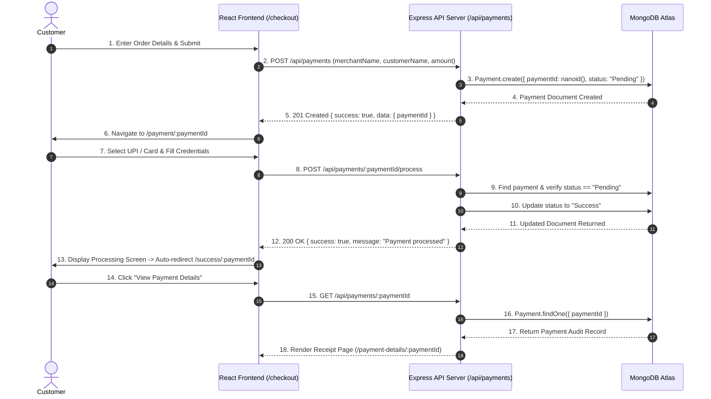
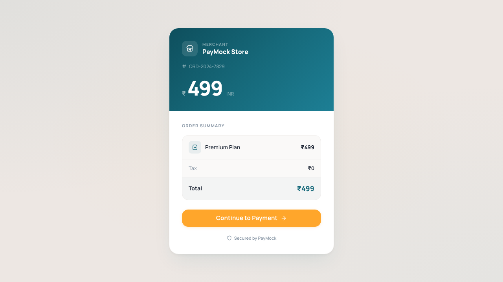
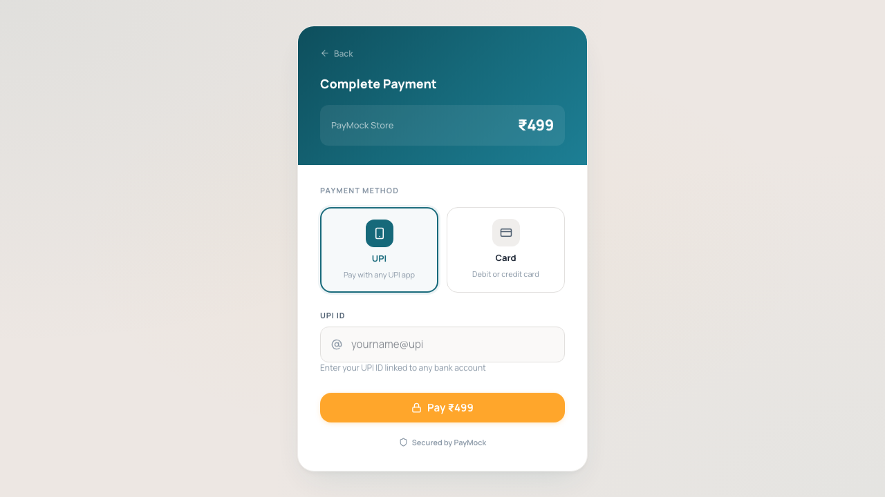
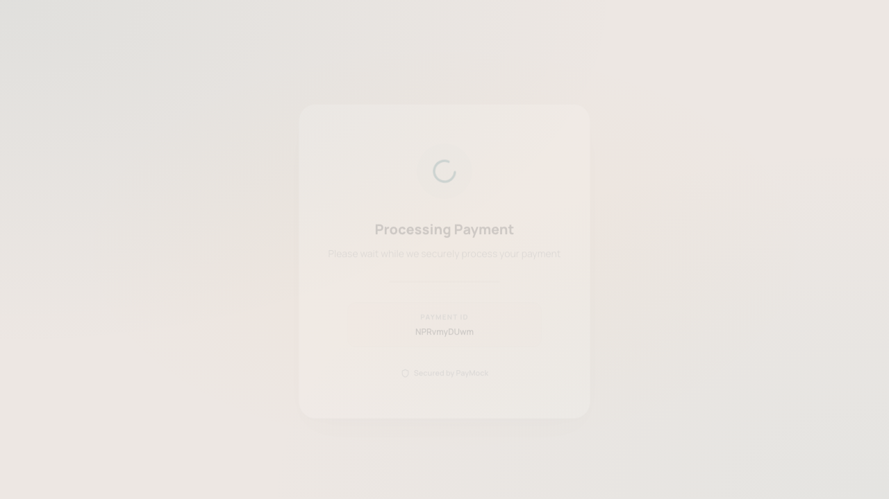
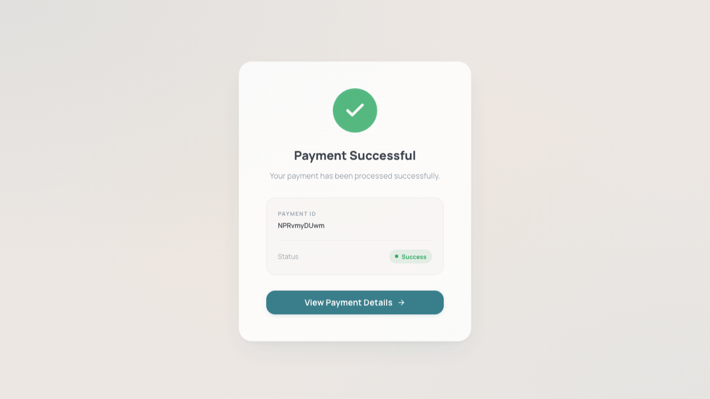
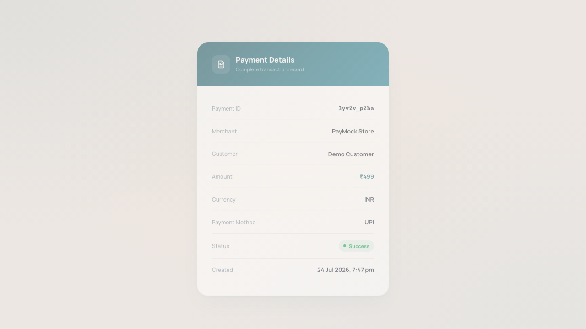
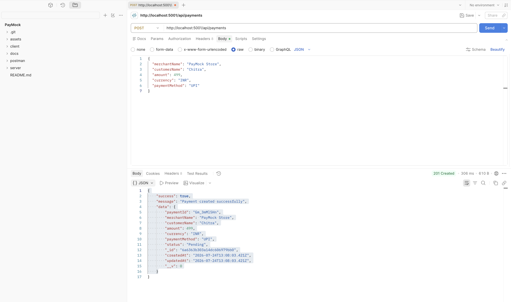
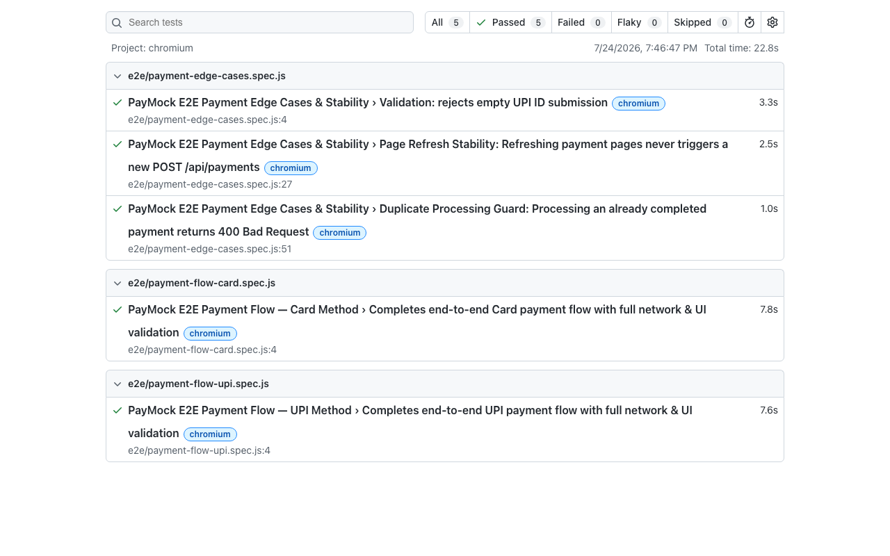

# 💳 PayMock — Full-Stack Simulated Payment Gateway

[](https://github.com/chitrakulkarni2830/payMock)
[](https://nodejs.org/)
[](https://expressjs.com/)
[](https://react.dev/)
[](https://tailwindcss.com/)
[](https://www.mongodb.com/)
[](https://playwright.dev/)
[](LICENSE)

**PayMock** is a full-stack simulated online payment gateway platform designed to replicate real-world payment processing workflows—from checkout initiation to asynchronous state resolution and transaction auditing.

Built with **React 19**, **Node.js**, **Express 5**, **MongoDB Atlas**, and automated with **Playwright E2E**, PayMock provides developers, recruiters, and technical evaluators with a complete, production-grade model of how modern payment systems handle state transitions, idempotency, API security, and UI user experience.

---

## 🎯 Why Built?

When building modern web applications, integrating real payment gateways (like Stripe or Razorpay) introduces dependency on live sandbox API keys, merchant accounts, and webhooks. 

**PayMock** solves this problem by providing a standalone, end-to-end simulated gateway that:
- **Simulates real checkout UX**: Full navigation flow covering merchant checkout, payment method selection, asynchronous processing simulation, and status verification.
- **Enforces backend state safety**: Strict payment status transition rules (`Pending` $\rightarrow$ `Success`/`Failed`) preventing race conditions, duplicate charges, or redundant database creation.
- **Offers production testing patterns**: Includes comprehensive Postman API collections and 100% automated E2E testing with Playwright.

---

## ✨ Key Features

- **🛍️ Merchant Checkout**: Collect order details (Merchant Name, Customer Name, Amount) and auto-generate unique 10-character NanoID transaction tokens.
- **💳 Multi-Method Payment Processing**:
  - **UPI**: Instant virtual payment address validation (e.g., `user@okaxis`).
  - **Card**: Full debit/credit card validation (Card Number, Holder Name, Expiry, CVV).
- **🔒 Idempotency & Duplicate Guard**:
  - Payment records are created **once** upon checkout.
  - Refreshing payment pages or re-submitting requests references existing `paymentId` without redundant database writes.
  - Prevents processing already completed (`Success`/`Failed`) payments with strict HTTP 400 guards.
- **⚡ Real-Time Async State Resolution**: Visual loader and simulation phase transitioning payment state from `Pending` to `Success`.
- **📊 Detailed Transaction Receipts**: View complete metadata for completed payments (Amount, Currency, Status, Method, Timestamps, Transaction ID).
- **🎨 Glassmorphic Modern UI**: Dark-mode aesthetic powered by Tailwind CSS v4, dynamic Lucide React icons, responsive layout, and interactive micro-animations.
- **🧪 Complete Test Automation**: Playwright automated suite testing UI flows, API contracts, page refresh resilience, and invalid payloads.

---

## 🛠️ Technology Stack

| Layer | Technology | Description |
| :--- | :--- | :--- |
| **Frontend Framework** | **React 19** + **Vite 8** | Ultra-fast single-page app architecture |
| **Styling & Icons** | **Tailwind CSS v4** + **Lucide React** | Modern glassmorphic theme with responsive utilities |
| **Routing & HTTP** | **React Router 7** + **Axios** | Declarative navigation and promise-based REST calls |
| **Backend Runtime** | **Node.js** + **Express 5** | High-performance modular REST API server |
| **Database** | **MongoDB Atlas** + **Mongoose 9** | Cloud document database with strict schema validation |
| **ID Generation** | **NanoID** | Secure, collision-resistant 10-char payment identifiers |
| **E2E Automation** | **Playwright 1.61** | End-to-end browser testing & network assertion |
| **API Testing** | **Postman** | Comprehensive API collection test suite |

---

## 🏗️ Project Architecture & Application Workflow

### Architecture Overview

PayMock follows a decoupled client-server architecture. The React frontend interacts with the Express backend strictly via JSON REST APIs. All transaction state changes are persisted centrally in MongoDB Atlas.

```
┌─────────────────┐       HTTP / REST       ┌─────────────────┐      Mongoose DB      ┌─────────────────┐
│                 │  ─────────────────────► │                 │  ───────────────────► │                 │
│  React Frontend │                         │ Express Server  │                       │  MongoDB Atlas  │
│  (Port 5173)    │ ◄─────────────────────  │  (Port 5001)    │ ◄───────────────────  │  (Cloud Cluster)│
└─────────────────┘                         └─────────────────┘                       └─────────────────┘
```

### Complete Sequence Workflow



---

## 📂 Folder Structure

```
PayMock/
├── client/                     # React 19 Frontend Application
│   ├── src/
│   │   ├── components/         # Reusable UI Components (Navbar, Layout, Payment Forms)
│   │   ├── pages/              # Checkout, Payment, Processing, Success, Failed, Details
│   │   ├── services/           # Axios API Client Modules
│   │   ├── styles/             # Global CSS & Tailwind Configurations
│   │   ├── App.jsx             # React Router 7 Navigation Hierarchy
│   │   └── main.jsx            # Application Entrypoint
│   ├── package.json
│   └── vite.config.js
│
├── server/                     # Express 5 REST API Server
│   ├── src/
│   │   ├── config/             # MongoDB Atlas Connection Setup (db.js)
│   │   ├── controllers/        # Payment Logic & Idempotency Guards (paymentController.js)
│   │   ├── models/             # Mongoose Schemas (Payment.js)
│   │   ├── routes/             # Express Endpoint Router (paymentRoutes.js)
│   │   ├── app.js              # Express Middleware Setup
│   │   └── server.js           # Server Bootstrap & Environment Validator
│   ├── .env.example
│   └── package.json
│
├── tests/                      # Automated Playwright Test Suite
│   └── e2e/
│       ├── payment-flow-card.spec.js   # Card Checkout E2E Test
│       ├── payment-flow-upi.spec.js    # UPI Checkout E2E Test
│       └── payment-edge-cases.spec.js  # Validation & Idempotency Edge Cases
│
├── docs/                       # Project Architecture & Images
│   ├── architecture.md         # Detailed System Architecture Specification
│   └── images/                 # Visual Documentation Screenshots
│
├── assets/                     # README Visual Assets
├── playwright.config.js        # Playwright E2E Test Configuration
├── package.json                # Project Root Package Manifest
└── README.md                   # Main Project Documentation
```

---

## 📸 Screenshots & Visual Tour

| Screen | Description | Visual |
| :--- | :--- | :--- |
| **1. Checkout Page** | Initiate payment with merchant details, customer name, and item amount. |  |
| **2. Payment Page** | Select preferred payment method (**UPI** or **Card**) with dynamic form validation. |  |
| **3. Processing Screen** | Simulated asynchronous network processing phase. |  |
| **4. Success Screen** | Transaction confirmation with payment reference ID. |  |
| **5. Payment Details** | Detailed transaction receipt fetched directly from MongoDB Atlas. |  |
| **6. Postman API Testing** | Verification of backend REST endpoints using Postman. |  |
| **7. Playwright E2E Report** | Automated test suite validating end-to-end flows, API contracts, and edge cases. |  |

---

## 📡 API Endpoints Documentation

### 1. Create Payment Request
Creates a new payment record initialized in `Pending` state with a unique `paymentId`.

- **Endpoint**: `POST /api/payments`
- **Headers**: `Content-Type: application/json`

#### Request Body
```json
{
  "merchantName": "Amazon",
  "customerName": "Chitra Kulkarni",
  "amount": 1499,
  "paymentMethod": "UPI"
}
```

#### Response (`201 Created`)
```json
{
  "success": true,
  "message": "Payment created successfully",
  "data": {
    "_id": "66a12b4e8f1c2d0012345678",
    "paymentId": "k9X2mP7qL1",
    "merchantName": "Amazon",
    "customerName": "Chitra Kulkarni",
    "amount": 1499,
    "currency": "INR",
    "paymentMethod": "UPI",
    "status": "Pending",
    "createdAt": "2026-07-24T14:00:00.000Z",
    "updatedAt": "2026-07-24T14:00:00.000Z"
  }
}
```

---

### 2. Fetch Payment Details
Retrieves current payment status and details by `paymentId`. (Read-only endpoint).

- **Endpoint**: `GET /api/payments/:paymentId`

#### Response (`200 OK`)
```json
{
  "success": true,
  "data": {
    "paymentId": "k9X2mP7qL1",
    "merchantName": "Amazon",
    "customerName": "Chitra Kulkarni",
    "amount": 1499,
    "currency": "INR",
    "paymentMethod": "UPI",
    "status": "Success",
    "createdAt": "2026-07-24T14:00:00.000Z",
    "updatedAt": "2026-07-24T14:00:05.000Z"
  }
}
```

#### Error Response (`404 Not Found`)
```json
{
  "success": false,
  "message": "Payment not found"
}
```

---

### 3. Process Payment
Executes payment processing for the selected method. Validates payload and guards against duplicate processing.

- **Endpoint**: `POST /api/payments/:paymentId/process`
- **Headers**: `Content-Type: application/json`

#### Request Payload (UPI)
```json
{
  "paymentMethod": "UPI",
  "upiId": "chitra@okaxis"
}
```

#### Request Payload (Card)
```json
{
  "paymentMethod": "Card",
  "cardNumber": "4111111111111111",
  "cardHolderName": "Chitra Kulkarni",
  "expiry": "12/29",
  "cvv": "123"
}
```

#### Response (`200 OK`)
```json
{
  "success": true,
  "message": "Payment processed successfully",
  "data": {
    "paymentId": "k9X2mP7qL1",
    "merchantName": "Amazon",
    "customerName": "Chitra Kulkarni",
    "amount": 1499,
    "paymentMethod": "Card",
    "status": "Success"
  }
}
```

#### Error Response (`400 Bad Request` — Duplicate Processing Guard)
```json
{
  "success": false,
  "message": "Payment is already Success"
}
```

---

## 🧪 Testing & Quality Assurance

PayMock includes dual-layer testing to guarantee backend robustness and frontend reliability.

### 1. API Testing (Postman)
- Verified all HTTP verbs, request schemas, status codes, and error responses.
- Tested edge cases including invalid `paymentId` lookup, missing request body parameters, and duplicate processing requests.

### 2. End-to-End Testing (Playwright)
The automated test suite in `tests/e2e/` covers 5 critical scenarios:
1. **`payment-flow-upi.spec.js`**: Complete checkout to success flow using UPI method.
2. **`payment-flow-card.spec.js`**: Complete checkout to success flow using Debit/Credit Card.
3. **`payment-edge-cases.spec.js` (Validation)**: Rejects empty UPI ID submissions with appropriate UI validation error.
4. **`payment-edge-cases.spec.js` (Refresh Resilience)**: Verifies that page refreshes during payment do NOT trigger duplicate `POST /api/payments` requests.
5. **`payment-edge-cases.spec.js` (Duplicate Guard)**: Confirms backend returns `400 Bad Request` when attempting to process an already completed transaction.

To execute the test suite:
```bash
npm run test:e2e
```

---

## ⚙️ Installation & Local Setup Guide

### Prerequisites
- **Node.js** (v18.0.0 or higher)
- **npm** (v9.0.0 or higher)
- **MongoDB Atlas** account (or local MongoDB instance)

### Step 1: Clone Repository
```bash
git clone https://github.com/chitrakulkarni2830/payMock.git
cd payMock
```

### Step 2: Install Server Dependencies
```bash
cd server
npm install
```

### Step 3: Configure Server Environment Variables
Create a `.env` file inside the `server/` directory:
```env
PORT=5001
MONGO_URI=mongodb+srv://<username>:<password>@cluster0.mongodb.net/paymock?retryWrites=true&w=majority
```

### Step 4: Install Client Dependencies
```bash
cd ../client
npm install
```

---

## 🚀 Running the Project

### Start Backend Server
```bash
cd server
npm run dev
```
> Server running at: `http://localhost:5001`

### Start Frontend Application
```bash
cd client
npm run dev
```
> Client application running at: `http://localhost:5173`

---

## 🔑 Environment Variables Reference

| Variable | Location | Required | Default | Description |
| :--- | :--- | :---: | :---: | :--- |
| `PORT` | `server/.env` | No | `5001` | Express server port number |
| `MONGO_URI` | `server/.env` | **Yes** | — | MongoDB Atlas connection URI |
| `VITE_API_URL` | `client/.env` | No | `http://localhost:5001/api` | Base API endpoint URL for frontend Axios calls |

---

## 🔮 Future Improvements

- [ ] **Webhook Integration**: Support merchant webhook callbacks (`payment.success`, `payment.failed`).
- [ ] **Merchant Dashboard**: Analytics page displaying transaction volume, success rates, and revenue metrics.
- [ ] **Refund Workflow**: Allow merchants to trigger full or partial refunds on successful payments.
- [ ] **Net Banking & Wallets**: Add simulated net banking portal and wallet balance selection.
- [ ] **JWT Merchant Auth**: Secure API endpoints with token-based merchant authentication.

---

## 📜 License

Distributed under the **ISC License**. See `LICENSE` for details.

---

## 👤 Author

**Chitra Kulkarni**  
- **GitHub**: [@chitrakulkarni2830](https://github.com/chitrakulkarni2830)  
- **Repository**: [https://github.com/chitrakulkarni2830/payMock](https://github.com/chitrakulkarni2830/payMock)
